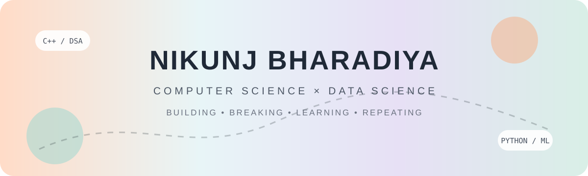
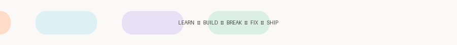
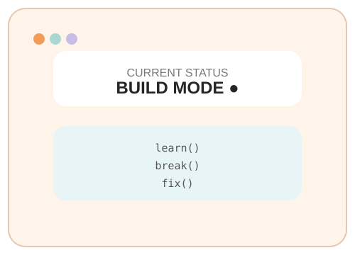
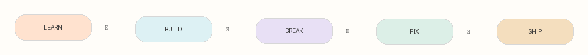
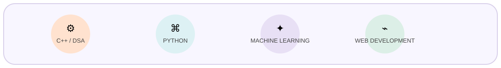
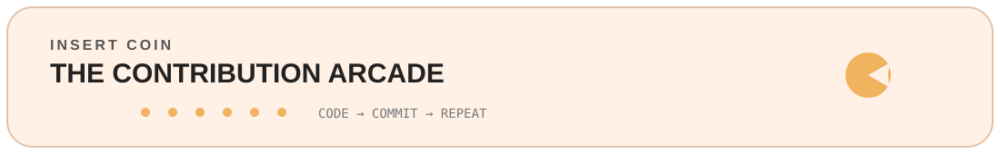
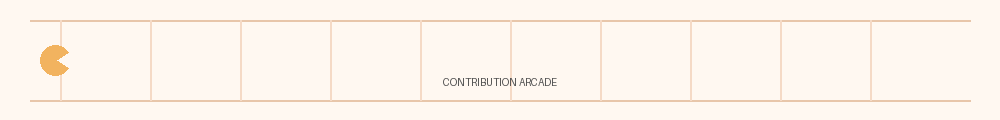
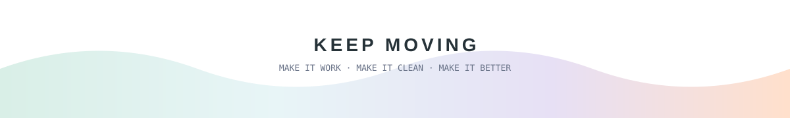

<div align="center">



<br>

<a href="https://www.linkedin.com/in/nikunj-bharadiya-956a4b301/">

</a>
&nbsp;
<a href="https://leetcode.com/u/NikunjBharadiya/">

</a>

<br><br>



</div>

<br>

<table width="100%">
<tr>
<td width="62%" valign="middle">

# Hey, I'm Nikunj 👋

**Computer Science & Data Science student at SRMIST.**

I like taking something I don't understand yet, breaking it into pieces, and turning it into code.

### Currently in build mode

🧠 **DSA & Problem Solving**  
⚙️ **C++**  
🐍 **Python**  
🤖 **Machine Learning**  
🌐 **Web Development**  
🏗️ **System Design**

</td>

<td width="38%" align="center">



</td>
</tr>
</table>

<br>

<div align="center">



</div>

<br>

## 🧰 The Toolbox

<div align="center">



<br><br>


</div>

<br>

<table width="100%">
<tr>

<td width="50%" valign="top">

### 🧠 LEARNING

```text
DATA STRUCTURES
██████████████████░░

C++
████████████████░░░░

PYTHON
███████████████░░░░░

MACHINE LEARNING
████████████░░░░░░░░

SYSTEM DESIGN
████████░░░░░░░░░░░░
```

</td>

<td width="50%" valign="top">

### ⚡ MY LOOP

```text
        ┌─────────────┐
        │    LEARN    │
        └──────┬──────┘
               ↓
        ┌─────────────┐
        │    BUILD    │
        └──────┬──────┘
               ↓
        ┌─────────────┐
        │    BREAK    │
        └──────┬──────┘
               ↓
        ┌─────────────┐
        │     FIX     │
        └──────┬──────┘
               ↓
        ┌─────────────┐
        │    SHIP     │
        └──────┬──────┘
               │
               └────────↺
```

</td>

</tr>
</table>

<br>

<div align="center">



<br>



</div>

<br>

<div align="center">



<br><br>

<sub>Built with curiosity · improved with consistency · shipped with caffeine ☕</sub>

</div>
